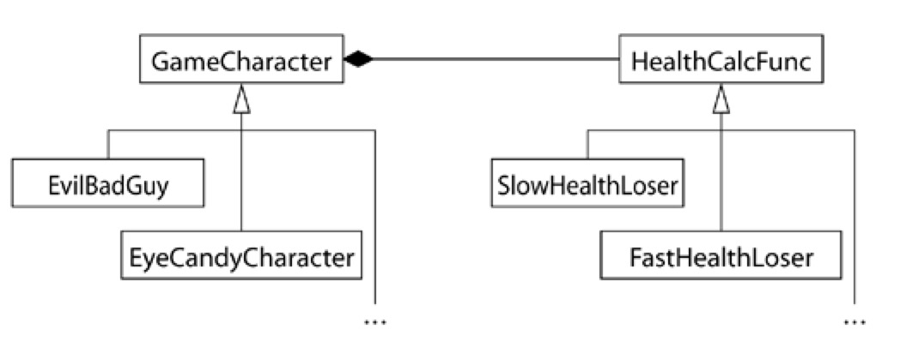

# Tips 35: Consider alternatived to virtual functions

>  本文将介绍C++接口设计相关的方法，介绍在接口设计时除virtual之外的其他选择

[TOC]

## 起源

先看一个例子:
假设你在设计一个游戏的人物类，不同的人物的血量降低方式并不一样，因此有一个接口`healthValue`

```cpp
class GameCharacter{
public:
    virtual int healthValue() const {
        // ...
    }
};  
```

现在我们考虑其他方式来定义接口`healthValue`

## NVI实现模板方法模式

>模板方法设计模式：我们知道实现某个业务的步骤，但具体算法需要子类分别实现。

```cpp
class GameCharacter{
public:
    int healthValue() const {
        // do sth. before
        int value = doHealthValue();
        // do sth. after
        return value;
    }
private:
    virtual int doHealthValue() const{
        return _health_value;
    }

    int _health_value = 10;
}; 
```

NVI Idiom的好处在于，在调用doHealthValue前可以做一些设置上下文的工作，调用后可以清除上下文。 比如在调用前给互斥量（mutex）加锁、验证前置条件、类的不变式；调用后给互斥量解锁、验证后置条件、类的不变式等。

在这个代码中，`doHealthValue`在子类中是不可调用的(因为为private)，然而子类却可以重写它。 C++允许这样做是有充分理由的： ***父类拥有何时（when）调用该接口的权利；子类拥有如何（how）实现该接口的权利。***， 如下：

```cpp
#include "../common.h"

using namespace std;

class GameCharacter
{
public:
    int healthValue() const
    {
        // ...
        int value = doHealthValue();
        return value;
    }

private:
    virtual int doHealthValue() const
    {
        printf("Base::do()\n");
        return _health_value;
    }

protected:
    int _health_value = 10;
};

class person : public GameCharacter
{
private:
    int doHealthValue() const override
    {
        printf("drive::do()\n");
        return _health_value * 2;
    }
};

int main()
{
    GameCharacter obj1;
    int v = obj1.healthValue();
    printf("obj1's health value: %d\n", v);

    GameCharacter *obj2 = new person();
    v = obj2->healthValue();
    printf("obj2's health value: %d\n", v);

    return 0;
}
// output
Base::do()
obj1's health value: 10
drive::do()
obj2's health value: 20
```

该方法特点：使用 ***public的non-virtual函数*** 调用 ***private的virtual函数***

***有时为了继承实现方式，子类虚函数会调用父类虚函数，这时doHealthValue就需要是protected了*** ，如下:

```cpp
#include "../common.h"

using namespace std;

class GameCharacter
{
public:
    virtual void setHealth(int a)
    {
        _health_value = a;
    }
    int healthValue() const
    {
        // ...
        int value = doHealthValue();
        return value;
    }

protected:
    virtual int doHealthValue() const // 该函数会被派生类调用，因此定义为protected
    {
        printf("Base::do()\n");
        return _health_value;
    }

protected:
    int _health_value = 10;
};

class person : public GameCharacter
{
public:
    person(int a) : GameCharacter()
    {
        _health_value = a;
    }

private:
    int doHealthValue() const override
    {
        printf("drive::do()\n");
        return GameCharacter::doHealthValue() * 2 + 1; // 处理的时派生类的数据
    }
};

int main()
{
    GameCharacter obj1;
    int v = obj1.healthValue();
    printf("obj1's health value: %d\n", v);

    GameCharacter *obj2 = new person(5);
    v = obj2->healthValue();
    printf("obj2's health value: %d\n", v);

    return 0;
}
// output
Base::do()
obj1's health value: 10
drive::do()
Base::do()
obj2's health value: 11
```

> 有时（比如析构函数）虚函数还必须是public，那么就不能使用NVI了。


## 函数指针Strategy模式
上述的NVI随是实现了模板方法， ***但事实上还是在用虚函数*** 。我们甚至可以让healthValue()完全独立于角色的类，只在构造函数时把该函数作为参数传入。

```cpp
#include "../common.h"

using namespace std;
class GameCharacter;

int defaultHealthCalc(const GameCharacter &gc);
int defaultHealthCalc_1(const GameCharacter &gc);
class GameCharacter
{
public:
    typedef int (*HealthCalcFunc)(const GameCharacter &);
    GameCharacter(HealthCalcFunc hcf = defaultHealthCalc) : _healthFunc(hcf)
    {
    }
    void setHealth(int a)
    {
        _health_value = a;
    }
    int healthValue() const
    {
        // ...
        int value = _healthFunc(*this);
        return value;
    }

    int getHealth() const
    {
        return _health_value;
    }

private:
    HealthCalcFunc _healthFunc;

protected:
    int _health_value = 10;
};

int defaultHealthCalc(const GameCharacter &gc)
{
    printf("defaultHealthCalc()\n");
    return gc.getHealth();
}

int defaultHealthCalc_1(const GameCharacter &gc)
{
    printf("defaultHealthCalc_1()\n");
    return gc.getHealth() + 1;
}

// class person : public GameCharacter
// {
// public:
//     person(int a) : GameCharacter()
//     {
//         _health_value = a;
//     }

// private:
//     int doHealthValue() const override
//     {
//         printf("drive::do()\n");
//         return GameCharacter::doHealthValue() * 2 + 1; // 处理的时派生类的数据
//     }
// };

int main()
{
    GameCharacter obj1;
    int v = obj1.healthValue();
    printf("obj1's health value: %d\n", v);

    GameCharacter obj2(defaultHealthCalc_1);
    v = obj2.healthValue();
    printf("obj2's health value: %d\n", v);

    // GameCharacter *obj2 = new person(5);
    // v = obj2->healthValue();
    // printf("obj2's health value: %d\n", v);

    return 0;
}
// output:
defaultHealthCalc()
obj1's health value: 10
defaultHealthCalc_1()
obj2's health value: 11
```

在上述例子中，因为`defaultHealthCalc_1`与`defaultHealthCalc`均为外部函数，因此无法访问private成员`_health_value`，解决方法就是 `设置为public` or `声明为friend function` or `通过public接口`


这便实现了策略模式。可以在运行时指定每个对象的生命值计算策略，比虚函数的实现方式有更大的灵活性：

- 同一角色类的不同对象可以有不同的healthCalcFunc。只需要在构造时传入不同策略即可。
- 角色的healthCalcFunc可以动态改变。只需要提供一个setHealthCalculator成员方法即可。


## function实现Strategy模式

这部分和上一部分基本相同，就是把函数指针扩大范围为`可调用对象`，包括:
1. function object
2. lambda
3. 成员函数
4. 外部函数

例子如下：

```cpp
#include "../common.h"

using namespace std;
class GameCharacter;

int defaultHealthCalc(const GameCharacter &gc);
int defaultHealthCalc_1(const GameCharacter &gc);

class GameCharacter
{
public:
    // typedef int (*HealthCalcFunc)(const GameCharacter &);
    // using HealthCalcFunc = std::function<int (const GameCharacter&)>;
    typedef std::function<int(const GameCharacter &)> HealthCalcFunc;

    explicit GameCharacter(HealthCalcFunc hcf = defaultHealthCalc) : _healthFunc(hcf)
    {
    }
    void setHealth(int a)
    {
        _health_value = a;
    }
    int healthValue() const
    {
        // ...
        int value = _healthFunc(*this);
        return value;
    }

    int getHealth() const
    {
        return _health_value;
    }

private:
    HealthCalcFunc _healthFunc;

protected:
    int _health_value = 10;
};

int defaultHealthCalc(const GameCharacter &gc)
{
    printf("defaultHealthCalc()\n");
    return gc.getHealth();
}

int defaultHealthCalc_1(const GameCharacter &gc)
{
    printf("defaultHealthCalc_1()\n");
    return gc.getHealth() + 1;
}

struct Calculator
{
    int operator()(const GameCharacter &gc) const
    {
        printf("Function object\n");
        return gc.getHealth();
    }
};

// class person : public GameCharacter
// {
// public:
//     person(int a) : GameCharacter()
//     {
//         _health_value = a;
//     }

// private:
//     int doHealthValue() const override
//     {
//         printf("drive::do()\n");
//         return GameCharacter::doHealthValue() * 2 + 1; // 处理的时派生类的数据
//     }
// };

int main()
{
    GameCharacter obj1;
    int v = obj1.healthValue();
    printf("obj1's health value: %d\n", v);

    GameCharacter obj2(defaultHealthCalc_1);
    v = obj2.healthValue();
    printf("obj2's health value: %d\n", v);

    auto cal = Calculator();
    GameCharacter obj3(cal);
    v = obj3.healthValue();
    printf("obj3's health value: %d\n", v);
    // GameCharacter *obj2 = new person(5);
    // v = obj2->healthValue();
    // printf("obj2's health value: %d\n", v);

    return 0;
}
// output:
defaultHealthCalc()
obj1's health value: 10
defaultHealthCalc_1()
obj2's health value: 11
Function object
obj3's health value: 10
```


## 古典的Strategy模式
可能你更关心 ***策略模式*** 本身而不是上述的这些实现，现在我们来讨论策略模式的一般实现。 在UML表示中，生命值计算函数HealthCalcFunc应当定义为一个类，拥有自己的类层级。 它的成员方法calc应当为虚函数，并在子类可以有不同的实现。




```cpp
#include "../common.h"

using namespace std;
class GameCharacter;

class Calculator
{
public:
    virtual int calc(const GameCharacter *gc) const;
};

class SlowCalculator : public Calculator
{
public:
    int calc(const GameCharacter *gc) const override;
};

Calculator *defaultHealthCalc = new Calculator();
class GameCharacter
{
public:
    explicit GameCharacter(Calculator *hcf = defaultHealthCalc) : _healthFunc(hcf)
    {
    }
    void setHealth(int a)
    {
        _health_value = a;
    }
    int healthValue() const
    {
        // ...
        int value = _healthFunc->calc(this);
        return value;
    }

    int getHealth() const
    {
        return _health_value;
    }

private:
    Calculator *_healthFunc;

protected:
    int _health_value = 10;
};

class person : public GameCharacter
{
public:
    person(int a, Calculator *calc) : GameCharacter(calc)
    {
        _health_value = a;
    }
};

inline int Calculator::calc(const GameCharacter *gc) const
{
    printf("Calculator::calc()\n");
    return gc->getHealth();
}

inline int SlowCalculator::calc(const GameCharacter *gc) const
{
    printf("SlowCalculator::calc()\n");
    return gc->getHealth() - 1;
}

int main()
{
    GameCharacter obj1;
    int v = obj1.healthValue();
    printf("obj1's health value: %d\n", v);

    Calculator *slow_calc = new SlowCalculator();
    GameCharacter obj2(slow_calc);
    v = obj2.healthValue();
    printf("obj2's health value: %d\n", v);

    GameCharacter *obj3 = new person(5, slow_calc);
    v = obj3->healthValue();
    printf("obj3's health value: %d\n", v);

    return 0;
}
// output:
Calculator::calc()
obj1's health value: 10
SlowCalculator::calc()
obj2's health value: 9
SlowCalculator::calc()
obj3's health value: 4
```

熟悉策略模式的人一眼就能看出来上述代码是策略模式的经典实现。 ***可以通过继承HealthCalcFunc很方便地生成新的策略*** 。


## summary
介绍了避免虚函数的几种方法：
1. NVI实现模板方法模式
2. 函数指针实现策略模式
3. std::function<int(const GameCharacter&)>实现策略模式
4. 经典的策略模式

## reference
1. https://harttle.land/2015/09/02/effective-cpp-35.html