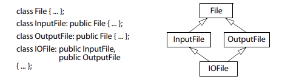
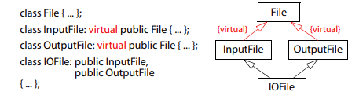
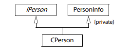

# Tips 40: 明智地使用多重继承

>  本文将介绍C++多重继承相关的问题

[TOC]

## 多重继承面临的问题

先看一个例子

```cpp
class A{
public:
    void check(){
        printf("A::check()");
    }
};

class B{
public:
    void check(){
        printf("A::check()");
    }
};

class A_B : public A, public B{
public:
    void call_check(){
        check();            // check不明确
    }
}
```
在上述例子中，对`check()`函数的调用是模棱两可的，因为两个`check`具有相同的匹配程度，因此会造成歧义，没有所谓的 ***最佳匹配***。
为了解决这个问题，我们必须告诉编译器要调用哪个版本的`check`：

```cpp
class A{
public:
    void check(){
        printf("A::check()\n");
    }
};

class B{
public:
    void check(){
        printf("A::check()\n");
    }
};

class A_B : public A, public B{
public:
    void call_check(){
        A::check();          
    }
};
```

---

多重继承的含义意思是继承一个以上的`base class`，但这些`base classed`并不常在继承体系中又有更高级的`base class`，因此会导致 ***菱形多重继承***:

<!--  -->
<p align="center">
  
</p>

```cpp
class File{
public:
    File(int a):a(a){}
    int a;
};

class InFile:  public File{
public:
    InFile():File(1){}
};

class OutFile: public File{
public:
    OutFile():File(0){}
};

class IOFile:public InFile, public OutFile{
public:
    void print(){
        std::cout << "InFile::a: " << InFile::a << ", OutFile::a: " << OutFile::a << "\n";
    }
};

int main(){
    // A_B ab;
    // ab.call_check();

    // case2
    IOFile io_file;
    io_file.print();
    printf("sizeof io_file without virtual inheritance: %ld\n", sizeof(io_file));
    return 0;
}

// output
// InFile::a: 1, OutFile::a: 0
// sizeof io_file without virtual inheritance: 8
```

***可见IOFile中默认是具有两个成员变量`a`*** ，为了避免这个问题，我们需要让File成为 ***virtual base class***。为了这样做，必须让所有继承它的class采用 ***virtual继承***，如下：

<!--  -->
<p align="center">
  
</p>

```cpp
class File{
public:
};

class InFile:virtual  public File{
public:
};

class OutFile: virtual public File{
public:
};

class IOFile:public InFile, public OutFile{
public:
};
```

## 善用多重继承

一般来说当我们需要实现这样的功能时：既需要继承接口，也需要继承实现，使用多重继承（`public`继承接口，`private`继承实现）

>还有一种解决方法是public继承+聚合。关于这个话题*tips39*中已经讨论过了

1. 多重继承实现如下：

<!--  -->
<p align="center">
  
</p>

```cpp
class IPerson{
public:
    IPerson(){}
    virtual ~IPerson(){}
    virtual std::string name() const = 0;
    virtual std::string data() const = 0;
};

const static std::vector<const char* > vec_of_name{"yunzheng", "ArriettyRain"};
const static std::vector<const char* > vec_of_data{"1997", "1998"};

class PersonInfo{
public:
    PersonInfo(int ID):_id(ID){}
    virtual ~PersonInfo(){}
    virtual const char* theName() const{
        return vec_of_name[_id];
    }
    virtual const char* theData() const{
        return vec_of_data[_id];
    }
    virtual const char* valueDelimOpen() const{
        return "{";
    }
    virtual const char* valueDelimClose() const{
        return "}";
    }
private:
    int _id;
};

class CPerson:public IPerson, private PersonInfo{
public:
    CPerson(int ID):PersonInfo(ID){}
    std::string name() const override{
        std::string name;
        name = name+valueDelimOpen()+std::string(theName())+valueDelimClose();
        return name;
    }
    std::string data() const override{
        std::string data;
        data = data+PersonInfo::valueDelimOpen()+std::string(theData())+PersonInfo::valueDelimClose();
        return data; 
    }
private:
    const char* valueDelimClose() const override{
        return "]";
    }
    const char* valueDelimOpen() const override{
        return "[";
    }

};
// output
// person_p.name: [yunzheng]
// person_p.data: {1997}
// person_r.name: [ArriettyRain]
// person_r.data: {1998}   
```

## Summary
1. 多重继承比单一继承复杂。他可能导致新的歧义性，以及对virtual继承的需要
2. `virtual`继承会增加大小、速度、初始化（及赋值）复杂度等等成本。如果`virtual base class`不带任何数据，将是最具实用价值的情况
3. 多重继承的确有正当用途。其中一个用途是涉及“`public`继承某个`Interface class`”和“`private`继承某个协助实现的`class`的两相结合”( ***其实用public继承+复合也可以实现，且可以降低代码耦合度*** )。


